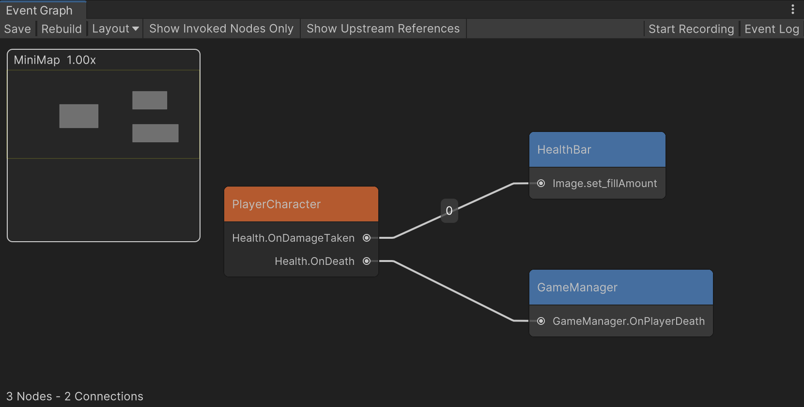
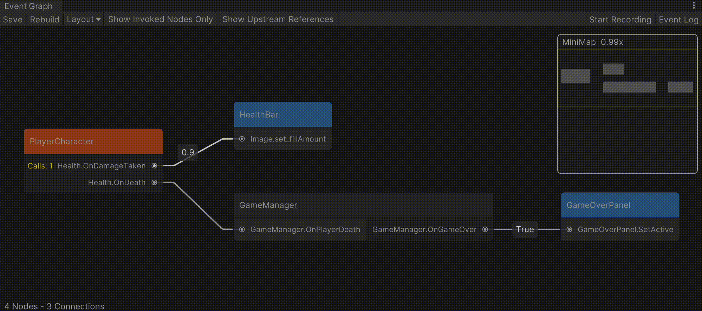

# unity-event-graph

Visualizes UnityEvents in a scene as a graph.





## Installation

Open the Package Manager in Unity (`Window` > `Package Manager`), click on the "+" button, select "Add package from git URL...", and paste the following URL:

```
https://github.com/FluffySpectre/unity-event-graph.git#1.0.1
```

Alternatively, you can add the following line to your manifest.json file located in the Packages directory of your Unity project:

```
"com.fluffyspectre.unityeventgraph": "https://github.com/FluffySpectre/unity-event-graph.git#1.0.1"
```

## Basic Usage

1. **Open the Unity Event Graph Window**:
    - In the Unity-Menubar go to `Window` > `Event Graph`.

2. **Visualize Events**:
    - You can select one or more GameObjects in the hierarchy, that contain the UnityEvents you want to visualize.
    - Click on "Rebuild" to create the graph from the selection or the entire scene.
    - You can see the connections between different events and their listeners.

3. **Layout-Options**:
    - Select "Layout" to choose from different layout strategies.
    - Drag nodes to rearrange the graph for better visibility.

4. **Rebuild the Graph**:
    - If you make changes to the UnityEvents, click the `Rebuild` button in the Unity Event Graph window to update the graph.

5. **Save node positions**:
    - Click on "Save" to persist the graphs node positions for the current active scene.
